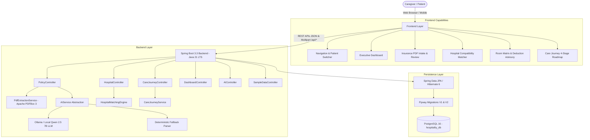

# Hospitality — System Architecture & Design

**Hospitality** (Holistic Optimization System for Policy-Integrated Admission & Treatment Intelligence) is an enterprise-grade healthcare decision-support and admission navigation system.

---

## 1. High-Level Architecture Diagram

---

## 2. Core Architectural Pillars

### A. Document Processing & AI Pipeline
1. **Document Intake**: Accepts multi-page policy PDFs via `multipart/form-data`.
2. **Text Extraction**: Uses Apache PDFBox 3 to extract textual layers with positional order.
3. **AI Structured Normalization**:
   - Primary: `OllamaAIService` sends structured schema prompts to a local Ollama LLM (`qwen2.5:7b` by default) requesting strict JSON output.
   - Fallback: `HeuristicPolicyExtractor` executes regex and keyword parsing if Ollama is offline or latency exceeds timeout thresholds.
4. **Validation & Persistence**: Extracted policy parameters are validated, sanitized, and saved in `DRAFT` state until user review and activation.

### B. Deterministic Hospital Matching Engine
The system does **NOT** use non-deterministic LLM tokens to make matching calculations. Instead, it evaluates constraints mathematically in Java:
- **Network Compatibility (40% Weight)**: 
  - $1.0$ if hospital is listed in policy network schedule or marked `IN_NETWORK`.
  - $0.25$ if out-of-network (reimbursement mode only).
- **Room Limit Compatibility (30% Weight)**:
  - $1.0$ if at least one room category daily rate $\le$ stated policy room limit.
  - $0.30$ if room rates exceed stated policy room limit (proportionate deduction warnings flagged).
- **Specialty & Clinical Department Availability (20% Weight)**:
  - $1.0$ if requested specialty exists in hospital departments.
  - $0.0$ if requested specialty is not listed.
  - $0.50$ neutral baseline if no specific specialty was requested for filtering.
- **Policy Constraints & Standard Exclusions (10% Weight)**:
  - $1.0$ baseline for clear exclusion verification.
- **Transparent Sub-Score Breakdown**:
  $$\text{Score} = \text{Round}\Big(\sum (\text{Raw Factor} \times \text{Weight}) \times 100\Big)$$
  Exposes `networkScore`, `roomScore`, `specialtyScore`, and `policyConstraintScore`.

### C. Room Category Compatibility Matrix
Evaluates every room tier in each hospital against the stated policy limit:
- `WITHIN_STATED_LIMIT`: Daily rate $\le$ policy limit. Headroom displayed.
- `POLICY_CONSIDERATION`: Exceeds limit by $\le 40\%$ (differential room rent typically out-of-pocket) or policy room cap is unspecified.
- `EXCEEDS_STATED_LIMIT`: Exceeds limit by $> 40\%$. Explicit warning: *Proportionate deductions may apply across doctor consultations, nursing, and surgical procedure charges as per policy terms.*
- `INFORMATION_UNAVAILABLE`: Room data missing.

### D. 4-Stage Care Journey Engine
Stages: `ADMISSION` $\rightarrow$ `INVESTIGATION` $\rightarrow$ `PROCEDURE` $\rightarrow$ `RECOVERY`.
- **Admission**: Pre-authorization submission, room assignment check, initial sanction tracking.
- **Investigation**: In-patient diagnostic billing, pre-hospitalization window claim guidelines.
- **Procedure**: Surgical package adherence, high-cost consumable exclusions, enhanced pre-auth.
- **Recovery**: Final bill reconciliation, non-medical deduction breakdown, post-discharge claim checklist.

---

## 3. Safety & Regulatory Boundaries
1. **Decision-Support Only**: The application provides informational guidance and does not diagnose, prescribe, or provide binding reimbursement guarantees.
2. **Deterministic Transparency**: Every match score and room deduction note is traceable to explicit policy numbers.
3. **Synthetic Data**: All demo records, policy numbers, and patient details are synthetic and explicitly labeled.
